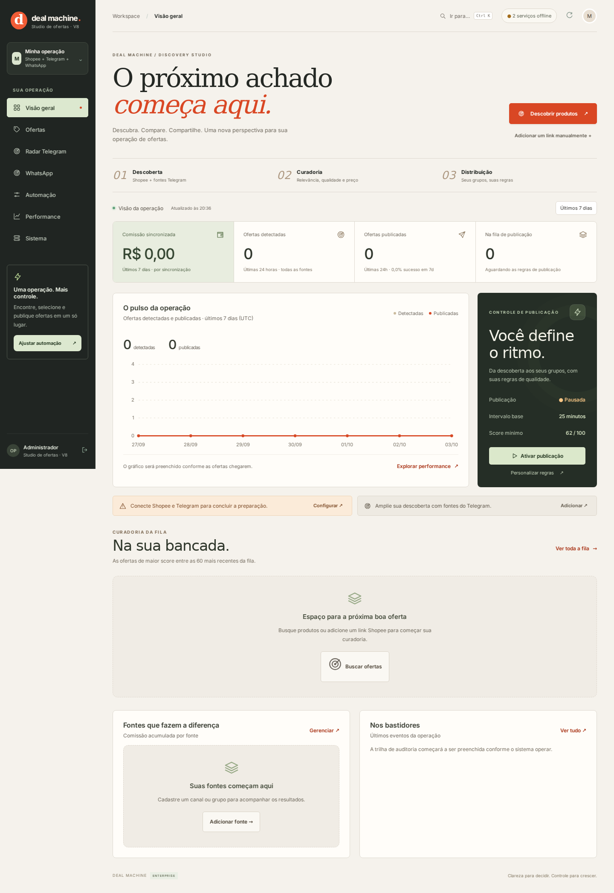

# Shopee Deal Machine V8 — Discovery Studio

Plataforma de automação para **descoberta, curadoria e distribuição de ofertas da Shopee**, com painel web, radar de fontes no Telegram e publicação multicanal em **Telegram + WhatsApp**.

## Novidades da V8

Novo painel responsivo com identidade editorial e busca com expansão de termos, relevância, avaliação, vendas e diversidade de lojas. Consulte [ATUALIZACAO-V8.md](ATUALIZACAO-V8.md) para atualizar uma instalação existente e conhecer os limites da descoberta.

## O que o projeto faz

- consulta ofertas pela Shopee Affiliate Open API;
- coleta links de fontes autorizadas no Telegram;
- processa e deduplica ofertas;
- calcula Deal Score e aplica filtros de qualidade;
- mantém histórico de preços;
- revalida dados antes da publicação;
- gera links de afiliado com tracking por destino;
- publica em Telegram e WhatsApp;
- integra WhatsApp por Evolution API v2;
- possui painel web para operação, filas, histórico e monitoramento;
- roda em Windows VPS ou Docker/Linux.

## Stack

**Backend:** Python, FastAPI, SQLAlchemy, HTTPX  
**Mensageria:** Telethon, Telegram Bot API, Evolution API v2  
**Dados:** SQLite; arquitetura preparada para PostgreSQL e Redis  
**Frontend:** HTML, CSS, JavaScript  
**Infra:** Docker, Caddy, PowerShell, GitHub Actions

## Fluxo principal

```text
Fontes autorizadas
      |
      v
Coleta / Ingestão
      |
      v
Deduplicação + Score + Filtros
      |
      v
Revalidação da oferta
      |
      +------------+
      |            |
      v            v
 Telegram      WhatsApp
```

## Recursos de confiabilidade

- deduplicação de produtos e mensagens;
- fila persistente;
- retry com espera;
- cooldown;
- recuperação por cursor;
- prevenção de reenvio cego quando a confirmação é incerta;
- revalidação antes da publicação;
- expiração de ofertas antigas;
- backups e observabilidade.

## Segurança

Nenhuma credencial real faz parte deste repositório.

- `.env` não é versionado;
- bancos de runtime não são versionados;
- sessões do Telegram não são versionadas;
- logs e backups não são versionados;
- `.env.example` contém somente placeholders.

## WhatsApp

A integração usa uma instância externa da **Evolution API v2**. O servidor Evolution não faz parte do projeto.

```dotenv
EVOLUTION_URL=
EVOLUTION_API_KEY=
EVOLUTION_INSTANCE=deal-machine
```

## Execução

### Windows

```text
ABRIR_CENTRAL_WINDOWS.cmd
```

### Python

```bash
python -m venv .venv
pip install -r requirements.txt
cp .env.example .env
python -m uvicorn app.main:app --host 127.0.0.1 --port 8787
```

## Testes

```bash
python -m pytest -q
```

A suíte cobre fluxos centrais, integrações multicanal, filas, idempotência, recuperação e regras de publicação.

## Para recrutadores

Este projeto demonstra experiência prática com:

**Python · APIs · Automação · Integrações · Backend · Filas · Mensageria · Docker · Linux · Debugging · Testes**

## Screenshots

Prints reais da V8 em execução local, sem contas conectadas nem dados de operação:



[Ver a versão móvel](docs/screenshots/painel-v8-mobile.png)

## Status

**Versão:** 8.0

**Integrações:** Shopee, Telegram e WhatsApp  
**Objetivo:** automação de ofertas com curadoria e distribuição multicanal.
